# lte_pm_platform

LTE PM Platform is a local developer stack for ingesting LTE PM archives into PostgreSQL and reviewing results through a small API and UI.

## Architecture

The system ingests PM archives, stores raw records in PostgreSQL, enriches them with entity and topology data, and exposes results through CLI, API, and UI.

```mermaid
flowchart LR

    subgraph S[Data Sources]
        A1[FTP server]
        A2[Local mirrored archives]
        A3[Topology workbook / curated reference inputs]
    end

    subgraph I[Ingestion Pipeline]
        B1[Discovery]
        B2[(ftp_remote_file)]
        B3[Staged download]
        B4[Staged ingest]
        B5[Archive streaming]
        B6[CSV parsing]
        B7[Counter normalization]
        B8[(pm_ltefdd_sample)]
    end

    subgraph E[Entity Layer]
        C1[sync-entities]
        C2[(ref_lte_entity_identity)]
    end

    subgraph T[Topology Authority and Enrichment]
        D1[Snapshot / reconciliation / apply]
        D2[Topology reference tables]
        D3[sync-topology]
        D4[(ref_lte_entity_topology_enrichment)]
    end

    subgraph Q[Analytics Layer]
        E1[SQL analytics / KPI queries]
    end

    subgraph X[Access Layer]
        F1[CLI]
        F2[API]
        F3[UI]
    end

    A1 --> B1
    A2 --> B1
    B1 --> B2
    B2 --> B3
    B3 --> B4
    B4 --> B5
    B5 --> B6
    B6 --> B7
    B7 --> B8

    B8 --> C1
    C1 --> C2

    A3 --> D1
    D1 --> D2

    C2 --> D3
    D2 --> D3
    D3 --> D4

    B8 --> E1
    D4 --> E1

    E1 --> F1
    E1 --> F2
    E1 --> F3
```



## Setup

```bash
docker compose up -d postgres

python -m venv .venv
source .venv/bin/activate
pip install -e .[dev]

cp .env.example .env

python -m lte_pm_platform.cli init-db
```

## Run

Start the API:

```bash
./.venv/bin/python -m uvicorn lte_pm_platform.api.app:app --host 127.0.0.1 --port 8000
```

Start the UI:

```bash
cd ui
npm install
npm run dev -- --host 127.0.0.1
```

Open:

- API: `http://127.0.0.1:8000/api/v1/health`
- UI: `http://127.0.0.1:5173`

## Quick verification

```bash
curl -sS http://127.0.0.1:8000/api/v1/health
curl -sS http://127.0.0.1:8000/api/v1/ready
```

Then open the UI and confirm the main pages load correctly.

On the `Ingestion` page you can now:

- review discovered 15-minute source intervals from the FTP registry
- trigger a run for one selected interval
- keep using the existing range-based run form for broader manual runs

## Interval Quality & Trust Visibility

The `Ingestion` page includes interval-level quality details to help operators decide what to run next.

For each discovered interval, the UI shows:

- `Families`
- `Missing`
- `Quality`
- `Topology`

`Quality` is based only on the required LTE PM families for this operator path. `Topology` is informational only and shows mapped/unmapped interval coverage when topology-observable rows exist, or `no topology rows` when they do not.

## KPI usage

Use the `KPI Results` page or the API to review data by family, aggregation level, and dataset.

Example:

```bash
curl -sS 'http://127.0.0.1:8000/api/v1/kpi-results/entity-time?family=prb&dataset_family=PM/sdr/ltefdd&limit=20'
```

## Topology workflow

Use the `Topology` page to:

1. Upload a workbook
2. Preview the snapshot
3. Run reconciliation
4. Review issues
5. Apply the snapshot
6. Run `sync-topology`

CLI example:

```bash
python -m lte_pm_platform.cli load-topology-regions --csv data/reference/regions.csv
python -m lte_pm_platform.cli sync-topology
```

## Notes

- FTP sources can be configured with `FTP_REMOTE_DIRECTORY` or `FTP_REMOTE_DIRECTORIES`.
- interval-triggered ingestion uses the existing FTP run queue and enforces 15-minute `interval_start` alignment
- See [docs/reference.md](https://github.com/ZaaWi/lte-pm-data-platform/blob/main/docs/reference.md) for more details.
