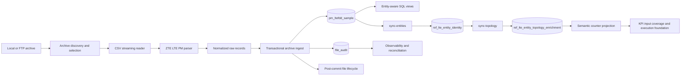

# lte_pm_platform

`lte_pm_platform` is a focused telecom data engineering project for ZTE LTE PM files.

The current goal is not a generic “big data platform”. It is a clean, inspectable ingestion and analytics slice for one vendor and one technology:

`archive -> inner CSV -> normalized raw facts -> governed audit -> entity-aware coverage analysis`

This repo is built to show practical data-engineering concerns clearly:

- transactional ingestion
- content-based idempotency
- file lifecycle control
- raw telecom dimensional modeling
- post-ingestion normalization
- SQL-first observability and coverage validation
- additive topology enrichment for site/region-aware reporting

## What It Does

Current implemented scope:

- ingest ZTE LTE PM `.tar.gz` and `.zip` archives
- stream inner CSV files without full extraction
- explode wide PM counter tables into normalized raw fact rows
- persist governed file audit records with hash-based duplicate protection
- support local mirrored discovery and FTP acquisition foundations
- support registry-backed staged FTP discovery, download, ingest, retry, and reconciliation
- support a local-first scheduler entrypoint for automated FTP pipeline cycles
- persist stronger FTP registry metadata for remote file visibility and operator control
- track post-commit file lifecycle state
- derive stable `logical_entity_key` values from real raw dimensions
- materialize entity identity with a separate `sync-entities` step
- support additive topology enrichment for site, region, and reporting-aware observability
- support a curated semantic KPI framework layer driven by counter aliases rather than raw counter IDs
- support a verified vendor-indicator semantic layer that captures indicator-to-raw-counter lineage
- load semantic counter dictionaries and KPI definitions through explicit rerunnable CSV-driven commands
- expose SQL views for semantic counter projection, KPI input coverage, unmapped counters, and provisional KPI definitions
- execute verified KPI slices for PRB, BLER, and RRC at entity/time grain
- expose explicit topology-aware verified KPI rollups at site/time and region/time grain
- expose validation and CLI inspection commands for the verified KPI stack across entity/site/region grains
- expose SQL views for ingest observability, lifecycle exceptions, coverage timelines, and daily coverage summaries

Current out of scope:

- multi-vendor support
- external orchestration frameworks
- API layer
- throughput KPI rollout
- bundled RRC accessibility KPI rollout
- large-scale performance tuning beyond a working local engineering slice

## Stack

- Python 3.12
- PostgreSQL 16
- SQL views and SQL-first analytics
- Docker Compose
- Typer CLI
- psycopg
- pytest
- Ruff

## Roadmap Status

- Milestone 5: staged FTP pipeline and retry/reconciliation workflow -> completed
- Scheduler-driven execution for the staged FTP pipeline -> completed
- FTP remote metadata and operational controls -> completed
- Entity / topology enrichment -> completed
- Semantic KPI framework foundation -> completed
- Verified vendor indicator semantic layer -> completed
- First verified PRB KPI slice execution -> completed
- Verified BLER KPI slice execution -> completed
- Verified RRC KPI slice execution -> completed
- Verified KPI topology-aware site/time rollups -> completed
- Verified KPI topology-aware region/time rollups -> completed
- Verified KPI CLI inspection and validation layer -> completed
- Active sub-milestone: Next verified KPI family review after PRB, BLER, and RRC

## Architecture



### Project Layout

```text
lte_pm_platform/
├── src/lte_pm_platform/
│   ├── cli.py
│   ├── config.py
│   ├── domain/
│   ├── db/
│   ├── pipeline/
│   └── utils/
├── sql/
│   ├── init/
│   └── queries/
├── data/
├── tests/
├── docker-compose.yml
├── Makefile
└── README.md
```

## Data Model

### Raw Fact Table

`pm_ltefdd_sample` is the current raw exploded fact table.

Each row represents one counter observation with:

- lineage: `source_file`, `csv_name`
- file metadata: `dataset_family`, `interval_start`, `revision`
- measurement time: `collect_time`
- raw entity dimensions: `sbnid`, `enbid`, `enodebid`, `cellid`, `meid`, `ani`
- counter payload: `counter_id`, `counter_value`

This is intentionally not over-normalized yet. It is a pragmatic raw fact shape for telecom PM analysis.

### Entity Normalization

Entity normalization is derived from real raw fields, not guessed telecom semantics.

Current empirical identity rules:

- `PM/sdr/ltefdd` -> `sbnid + enodebid + cellid`
- `PM/itbbu/ltefdd` -> `sbnid + enbid + cellid`
- `PM/itbbu/itbbuplat` -> `sbnid + meid`

The resulting key is `logical_entity_key`.

Important: this is a platform normalization key for current project use, not a vendor-global canonical identity.

### Topology Enrichment

Topology enrichment is additive and explicit.

- `logical_entity_key` remains the identity base
- curated mappings project entities into:
  - site
  - region
  - optional reporting hierarchy
- enrichment is materialized by an explicit rerunnable `sync-topology` step
- raw ingest and raw identity generation remain unchanged

### Semantic KPI Framework

Semantic KPI work is also additive and explicit.

- raw facts remain keyed by raw `counter_id`
- curated dictionary rows map `dataset_family + counter_id` to stable `counter_alias`
- curated vendor indicator rows map verified vendor indicator codes to semantic aliases and explicit raw-counter lineage
- KPI definitions reference semantic aliases, not raw counter IDs
- KPI validation and execution foundations operate through SQL views on top of entity/topology-aware raw facts
- the verified entity/time execution slices currently include:
  - `dl_prb_utilization`
  - `ul_prb_utilization`
  - `dl_bler`
  - `ul_bler`
  - `rrc_connected_users_max`
  - `rrc_connected_users_mean`
  - `rrc_connected_users_online`
- topology rollups remain separate and are not part of the base executed KPI output layer
- separate verified KPI rollup views now exist for:
  - `site_time`
  - `region_time`

### Verified KPI Views

Current verified KPI output views include:

- entity/time:
  - `vw_verified_prb_kpi_entity_time`
  - `vw_verified_bler_kpi_entity_time`
  - `vw_verified_rrc_kpi_entity_time`
- site/time:
  - `vw_verified_prb_kpi_site_time`
  - `vw_verified_bler_kpi_site_time`
  - `vw_verified_rrc_kpi_site_time`
- region/time:
  - `vw_verified_prb_kpi_region_time`
  - `vw_verified_bler_kpi_region_time`
  - `vw_verified_rrc_kpi_region_time`

Current verified KPI validation views include:

- entity/time:
  - `vw_verified_prb_kpi_execution_validation`
  - `vw_verified_bler_kpi_execution_validation`
  - `vw_verified_rrc_kpi_output_validation`
- site/time:
  - `vw_verified_prb_kpi_site_time_validation`
  - `vw_verified_bler_kpi_site_time_validation`
  - `vw_verified_rrc_kpi_site_time_validation`
- region/time:
  - `vw_verified_prb_kpi_region_time_validation`
  - `vw_verified_bler_kpi_region_time_validation`
  - `vw_verified_rrc_kpi_region_time_validation`

## Working Domain Hypothesis

Empirical, not vendor-confirmed:

- `PM/itbbu/itbbuplat` appears non-cell-level and likely node/BBU/platform-oriented because it lacks `CELLID` in validated samples and has much lower row/entity counts.
- `PM/itbbu/ltefdd` and `PM/sdr/ltefdd` appear cell-level because they contain `CELLID` and their distinct cell counts are close to the expected LTE project inventory.

This hypothesis is used for modeling and reporting only. It is not treated as vendor-documented truth.

## Transaction, Lifecycle, and Normalization Model

### Atomic Ingestion Unit

One archive ingest is atomic from the database perspective for:

- raw inserts into `pm_ltefdd_sample`
- the initial `file_audit` row

This means handled failures should no longer leave committed raw rows without a matching audit row.

### Transaction Model

`SUCCESS`
- raw rows and the initial audit row commit together
- if a success-hash race occurs, the loser rolls back and is recorded as `SKIPPED_DUPLICATE`

`FAILED`
- raw inserts roll back
- failed audit is written afterward with the error and lifecycle result

`SKIPPED_DUPLICATE`
- no new raw rows are inserted
- a duplicate audit row is written

### Idempotency Model

Duplicate protection is content-based, not name-based.

- `file_hash` is SHA-256 over archive bytes
- it does not depend on filename or path
- the same content at two different paths produces the same hash

Protection is enforced in two layers:

1. a pre-check for an existing successful `file_hash`
2. a DB unique-success-hash rule in `file_audit`

### File Lifecycle Model

File handling is post-commit. It is not part of the raw+audit DB transaction.

Current rules:

- `SUCCESS` -> move to `data/archive/`
- `SKIPPED_DUPLICATE` -> move to `data/archive/`
- `FAILED` -> move to `data/rejected/`

Lifecycle state is tracked in `file_audit.lifecycle_status`:

- `PENDING`
- `COMPLETED`
- `FAILED`

### Normalization Model

Entity sync is explicitly post-ingestion and eventual.

- `sync-entities` is not part of archive ingest
- the archive transaction ends at raw facts + initial audit
- `sync-entities` materializes `ref_lte_entity_identity`
- successful ingests are then marked through `normalization_status`

Normalization state is tracked in `file_audit.normalization_status`:

- `PENDING`
- `COMPLETED`
- `FAILED`
- `NOT_REQUIRED`

## Database Initialization

Initialize Postgres:

```bash
cp .env.example .env
docker compose up -d postgres
python -m venv .venv
source .venv/bin/activate
pip install -e .[dev]
python -m lte_pm_platform.cli init-db
```

`init-db` applies SQL files in an explicit dependency order and is intended to be re-runnable on a populated database.

## Example CLI Workflow

### 1. Initialize the database

```bash
python -m lte_pm_platform.cli init-db
```

### 2. Load a controlled local validation slice

```bash
python -m lte_pm_platform.cli local-list \
  --family PM/itbbu/ltefdd \
  --start 2026-03-05 \
  --end 2026-03-05 \
  --revision-policy additive

python -m lte_pm_platform.cli load-sample \
  --zip data/input/local_selection/UMEID_ITBBU_LTEFDD_PM_COMMON_ZTE_20260305_0015.tar.gz
```

### 3. Reconcile audit and files

```bash
python -m lte_pm_platform.cli reconcile-ingest-files --limit 100
```

### 4. Run entity normalization

```bash
python -m lte_pm_platform.cli sync-entities
```

### 5. Load curated topology mappings and sync enrichment

```bash
python -m lte_pm_platform.cli load-topology-regions --csv data/reference/regions.csv
python -m lte_pm_platform.cli load-topology-sites --csv data/reference/sites.csv
python -m lte_pm_platform.cli load-topology-reporting --csv data/reference/reporting.csv
python -m lte_pm_platform.cli load-topology-entity-map --csv data/reference/entity_site_map.csv
python -m lte_pm_platform.cli sync-topology
python -m lte_pm_platform.cli list-unmapped-entities --limit 20
python -m lte_pm_platform.cli summarize-site-coverage --limit 20
python -m lte_pm_platform.cli summarize-region-coverage --limit 20
```

### 6. Validate coverage over time

```bash
python -m lte_pm_platform.cli summarize-coverage-timeline --limit 20
python -m lte_pm_platform.cli compare-expected-cells-timeline --expected 10251 --limit 20
```

### 7. Load semantic KPI references and inspect coverage

```bash
python -m lte_pm_platform.cli load-counter-dictionary --csv data/reference/counter_dictionary.csv
python -m lte_pm_platform.cli load-kpi-definitions --csv data/reference/kpi_definitions.csv
python -m lte_pm_platform.cli list-unmapped-counters --limit 20
python -m lte_pm_platform.cli list-provisional-kpis --limit 20
python -m lte_pm_platform.cli summarize-kpi-input-coverage --limit 20
```

### 8. Inspect the verified KPI stack

Entity/time:

```bash
python -m lte_pm_platform.cli list-verified-prb-kpi-entity-time --limit 20
python -m lte_pm_platform.cli list-verified-bler-kpi-entity-time --limit 20
python -m lte_pm_platform.cli list-verified-rrc-kpi-entity-time --limit 20
python -m lte_pm_platform.cli validate-verified-rrc-kpi-entity-time
```

Site/time:

```bash
python -m lte_pm_platform.cli list-verified-prb-kpi-site-time --limit 20
python -m lte_pm_platform.cli list-verified-bler-kpi-site-time --limit 20
python -m lte_pm_platform.cli list-verified-rrc-kpi-site-time --limit 20
python -m lte_pm_platform.cli validate-verified-prb-kpi-site-time
python -m lte_pm_platform.cli validate-verified-bler-kpi-site-time
python -m lte_pm_platform.cli validate-verified-rrc-kpi-site-time
```

Region/time:

```bash
python -m lte_pm_platform.cli list-verified-prb-kpi-region-time --limit 20
python -m lte_pm_platform.cli list-verified-bler-kpi-region-time --limit 20
python -m lte_pm_platform.cli list-verified-rrc-kpi-region-time --limit 20
python -m lte_pm_platform.cli validate-verified-prb-kpi-region-time
python -m lte_pm_platform.cli validate-verified-bler-kpi-region-time
python -m lte_pm_platform.cli validate-verified-rrc-kpi-region-time
```

### 9. Backfill old lifecycle rows if needed

```bash
python -m lte_pm_platform.cli backfill-lifecycle-status --limit 100
```

### 10. Operate the staged FTP pipeline

Inspect staged FTP state:

```bash
python -m lte_pm_platform.cli ftp-status
python -m lte_pm_platform.cli ftp-failures --limit 20
python -m lte_pm_platform.cli ftp-failure-show --id 101
python -m lte_pm_platform.cli ftp-reconcile --limit 20
```

Run one scheduler-style FTP cycle:

```bash
python -m lte_pm_platform.cli ftp-run-cycle --limit 20
python -m lte_pm_platform.cli ftp-run-cycle --limit 20 --retry-failed
python -m lte_pm_platform.cli ftp-run-cycle --limit 20 --dry-run
```

Retry selected failed rows explicitly:

```bash
python -m lte_pm_platform.cli ftp-retry-download --id 101 --id 102
python -m lte_pm_platform.cli ftp-retry-ingest --id 205 --id 206
```

## Time-Aware Archive Selection

Supported archive names include:

- `UMEID_ITBBU_ITBBUPLAT_PM_COMMON_ZTE_YYYYMMDD_HHMM.tar.gz`
- `UMEID_ITBBU_ITBBUPLAT_PM_COMMON_ZTE_YYYYMMDD_HHMM_R1.tar.gz`
- `UMEID_ITBBU_LTEFDD_PM_COMMON_ZTE_YYYYMMDD_HHMM.tar.gz`
- `UMEID_ITBBU_LTEFDD_PM_COMMON_ZTE_YYYYMMDD_HHMM_R1.tar.gz`
- `UMEID_LTEFDD_PM_COMMON_ZTE_YYYYMMDD_HHMM.tar.gz`
- `UMEID_LTEFDD_PM_COMMON_ZTE_YYYYMMDD_HHMM_R1.tar.gz`

Accepted time inputs:

- `YYYYMMDDHHMM`
- `YYYY-MM-DD HH:MM`
- `YYYY-MM-DD`

Selection window semantics:

- start is inclusive
- end is exclusive internally
- date-only `--start 2026-03-05` means `2026-03-05 00:00:00`
- date-only `--end 2026-03-05` means `2026-03-06 00:00:00`

Revision policies:

- `additive`
- `base-only`
- `revisions-only`
- `latest-only`

Default is `additive`, based on observed `_R1` supplement behavior in validated samples.

## SQL Views

### Raw and Entity-Aware Analytics

- `vw_pm_raw_with_entity`
- `vw_pm_entity_topology_projection`
- `vw_pm_raw_with_entity_topology`
- `vw_pm_raw_with_counter_semantics`
- `vw_pm_counter_agg_by_entity_time_counter`
- `vw_pm_entity_counter_coverage`
- `vw_kpi_scope_entity_counter_base`

### Coverage and Completeness

- `vw_pm_logical_entity_counts_by_time`
- `vw_pm_site_coverage`
- `vw_pm_region_coverage`
- `vw_semantic_counter_mapping_gaps`
- `vw_semantic_kpi_input_coverage`
- `vw_pm_cell_entity_counts_by_interval`
- `vw_pm_cell_entity_counts_timeline`
- `vw_pm_combined_ltefdd_cell_coverage_timeline`
- `vw_pm_daily_family_coverage`
- `vw_pm_daily_combined_ltefdd_coverage`

### KPI Semantic Views

- `vw_semantic_kpi_definition_details`
- `vw_semantic_provisional_kpis`
- `vw_semantic_kpi_base_inputs`

### Ingest Observability

- `vw_file_ingest_observability`
- `vw_file_lifecycle_exceptions`

## Example SQL Queries

### Ingest observability

```sql
SELECT
    source_file,
    status,
    raw_row_count,
    lifecycle_status,
    normalization_status,
    processed_at
FROM vw_file_ingest_observability
ORDER BY processed_at DESC;
```

### Lifecycle exceptions

```sql
SELECT
    source_file,
    status,
    lifecycle_status,
    final_file_path,
    error_message
FROM vw_file_lifecycle_exceptions
ORDER BY processed_at DESC;
```

### Normalization status

```sql
SELECT
    source_file,
    status,
    normalization_status,
    normalized_at,
    normalization_error
FROM vw_file_ingest_observability
ORDER BY processed_at DESC;
```

### Daily LTEFDD coverage by family

```sql
SELECT
    collect_date,
    dataset_family,
    distinct_cell_entities,
    distinct_collect_times,
    distinct_source_files
FROM vw_pm_daily_family_coverage
WHERE dataset_family IN ('PM/itbbu/ltefdd', 'PM/sdr/ltefdd')
ORDER BY collect_date, dataset_family;
```

### Daily combined LTEFDD coverage

```sql
SELECT
    collect_date,
    combined_observed_cells,
    row_count,
    distinct_source_files
FROM vw_pm_daily_combined_ltefdd_coverage
ORDER BY collect_date;
```

## Current Scope vs Future Scope

### Current Scope

- single-vendor ZTE LTE PM focus
- governed local and FTP-style archive ingestion
- raw fact persistence with real entity dimensions
- entity normalization as a separate step
- topology enrichment as a separate step
- semantic KPI dictionary and KPI definition framework
- SQL-first coverage and observability layer
- verified KPI activation for PRB, BLER, and direct-mapped RRC slices
- explicit topology-aware verified KPI rollups at site/time and region/time
- validation views and CLI inspection commands for the verified KPI stack
- KPI execution remains gated by verified counter semantics for any new KPI family

### Future Scope

- broader verified KPI families beyond PRB, BLER, and direct-mapped RRC
- bundled RRC accessibility KPI rollout only after explicit review
- throughput KPI rollout only after authoritative vendor evidence resolves provisional volume lineage
- configurable local source roots and richer operational config
- better bulk-loading performance for larger daily slices
- broader enrichment around site/region/inventory data
- API layer and broader operational expansion

## Development

Common commands:

```bash
make init-db
make summarize-coverage LIMIT=20
make summarize-coverage-timeline LIMIT=20
make compare-expected-cells EXPECTED=10251
make compare-expected-cells-timeline EXPECTED=10251 LIMIT=20
make reconcile-ingest-files LIMIT=100
make backfill-lifecycle-status LIMIT=100
make test
make check
```

Checks:

```bash
pytest
ruff check .
```
