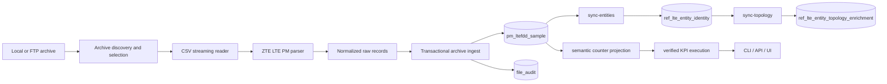

# lte_pm_platform

`lte_pm_platform` is a focused LTE PM engineering slice for ZTE archive files.

It ingests PM archives into PostgreSQL, materializes stable logical entities, applies additive topology enrichment, executes a small verified KPI stack, and exposes the platform through CLI, API, and a minimal operator UI.

## What It Does

- ingests ZTE LTE PM `.tar.gz` and `.zip` archives
- streams inner CSVs without full extraction
- stores normalized raw counter facts in PostgreSQL
- tracks file audit, lifecycle, retries, and reconciliation
- materializes deterministic `logical_entity_key` values with `sync-entities`
- supports explicit topology enrichment with `sync-topology`
- loads semantic counter dictionaries and KPI definitions from curated CSVs
- executes verified KPI slices at `entity_time`
- exposes API and UI flows for inspection and manual operator control

Verified KPI families currently implemented:

- PRB
  - `dl_prb_utilization`
  - `ul_prb_utilization`
- BLER
  - `dl_bler`
  - `ul_bler`
- direct-mapped RRC
  - `rrc_connected_users_max`
  - `rrc_connected_users_mean`
  - `rrc_connected_users_online`

Total verified KPIs currently implemented: `7`

## Current State

Implemented:

- ingestion pipeline
- raw LTE PM storage in Postgres
- entity identity layer
- topology enrichment and sync flow
- semantic counter dictionary
- KPI definition layer
- verified KPI execution
- FastAPI API baseline
- minimal in-repo operator UI

Verified working now:

- API `health` / `ready`
- ingestion status, failures, and reconciliation preview
- topology unmapped/site/region coverage endpoints
- KPI Results `entity-time` in the browser
- KPI Validation `entity-time` for PRB and BLER
- KPI Results date filters normalized to day bounds
- KPI Results offset-based paging with `Rows`, `Previous`, `Next`

Entity-time stabilization already in place:

- KPI Results `entity-time` uses early filtering and explicit counter narrowing
- KPI Validation `entity-time` for PRB and BLER avoids heavy execution-validation view scans
- `dataset_family` is required for KPI Results `entity-time`
- if `entity-time` dates are omitted, the backend defaults to the latest `collect_time` for that `dataset_family`

## Current Limitations

- topology enrichment exists structurally, but meaningful `site_time` and `region_time` outputs depend on curated topology reference data being loaded first
- local dev currently has a reference-data gap:
  - the README workflow references topology CSV inputs
  - those curated CSVs are not bundled in this repo
- until topology references are loaded, `sync-topology` produces enrichment rows as `UNMAPPED`
- because of that, `site_time` and `region_time` KPI routes are implemented but are not meaningful by default in local development
- RRC validation fast-path is not yet the primary verified local path; PRB and BLER entity-time validation are the stabilized operator path today
- throughput KPIs remain blocked pending authoritative vendor evidence for provisional volume lineage
- bundled RRC accessibility KPIs are not rolled out

## Stack

- Python 3.12
- PostgreSQL 16
- SQL-first analytics and KPI execution
- Typer CLI
- FastAPI
- Vite + TypeScript
- Docker Compose
- psycopg
- pytest
- Ruff

## Architecture



Project layout:

```text
lte_pm_platform/
├── src/lte_pm_platform/
│   ├── api/
│   ├── cli.py
│   ├── db/
│   ├── pipeline/
│   └── services/
├── sql/
│   ├── init/
│   └── queries/
├── data/
├── ui/
├── tests/
├── docs/
├── docker-compose.yml
└── README.md
```

## Quick Start

### 1. Initialize local services

```bash
cp .env.example .env
docker compose up -d postgres
python -m venv .venv
source .venv/bin/activate
pip install -e .[dev]
python -m lte_pm_platform.cli init-db
```

### 2. Load a local PM sample and materialize entities

```bash
python -m lte_pm_platform.cli load-sample \
  --zip data/input/local_selection/UMEID_ITBBU_LTEFDD_PM_COMMON_ZTE_20260305_0000.tar.gz

python -m lte_pm_platform.cli sync-entities
```

### 3. Load verified KPI references

```bash
python -m lte_pm_platform.cli load-counter-dictionary --csv data/reference/counter_dictionary.csv
python -m lte_pm_platform.cli load-kpi-definitions --csv data/reference/kpi_definitions_rrc_slice.csv
```

Note:

- the canonical counter dictionary file exists in the repo
- KPI definition loading is per file; PRB, BLER, and RRC slices are currently maintained as separate seeds
- see `docs/reference.md` for the current reference-load workflow

### 4. Start the API and UI

API:

```bash
./.venv/bin/python -m uvicorn lte_pm_platform.api.app:app --host 0.0.0.0 --port 8000
```

UI:

```bash
cd ui
npm install
npm run dev
```

### 5. Verify the stabilized entity-time path

- API: `http://localhost:8000/api/v1/health`
- UI: `http://localhost:5173`
- use `KPI Results` with:
  - `family = prb|bler|rrc`
  - `grain = entity-time`
  - `dataset_family = PM/sdr/ltefdd` or `PM/itbbu/ltefdd`

## Next Milestone

**Topology reference-data completion and CM-driven topology mapping analysis**

Immediate work:

- provide curated topology CSV inputs for local development
- load region, site, reporting, and entity-to-site mapping references
- rerun `sync-topology` with real mappings
- verify meaningful `site_time` and `region_time` KPI outputs
- analyze CM or other authoritative sources for stable site / region / reporting mapping

Not the immediate priority:

- scheduler-first operational expansion
- broader KPI-family rollout
- throughput rollout

## Development

Common commands:

```bash
python -m lte_pm_platform.cli init-db
python -m lte_pm_platform.cli sync-entities
python -m lte_pm_platform.cli sync-topology
python -m lte_pm_platform.cli ftp-status
pytest
ruff check .
cd ui && npm run build
```

For deeper operational workflows, reference loads, CLI inventories, and SQL/view notes, see:

- `docs/reference.md`
