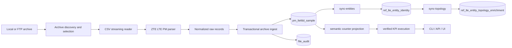

# lte_pm_platform

`lte_pm_platform` is a focused LTE PM engineering slice for ZTE archive files.

It ingests PM archives into PostgreSQL, materializes stable logical entities, applies additive topology enrichment, executes a small verified KPI stack, and exposes the platform through CLI, API, and a minimal operator UI.

## What It Does

- ingests ZTE LTE PM `.tar.gz` and `.zip` archives
- streams inner CSVs without full extraction
- stores normalized raw counter facts in PostgreSQL
- tracks file audit, lifecycle, retries, and reconciliation
- supports explicit multi-directory FTP source scanning with backward-compatible single-path mode
- materializes deterministic `logical_entity_key` values with `sync-entities`
- supports explicit topology enrichment with `sync-topology`
- seeds local topology references from the LTE Project Parameters workbook
- loads semantic counter dictionaries and KPI definitions from curated CSVs
- executes verified KPI slices at `entity_time`
- exposes operator-facing `site_time` and `region_time` rollups for verified PRB and BLER with direct fast paths
- exposes API and UI flows for inspection and manual operator control

Verified KPI families currently implemented:

- PRB
  - `dl_prb_utilization`
  - `ul_prb_utilization`
- BLER
  - `dl_bler`
  - `ul_bler`
- direct-mapped RRC
  - `rrc_connected_users_max`
  - `rrc_connected_users_mean`
  - `rrc_connected_users_online`

Total verified KPIs currently implemented: `7`

## Current State

Implemented:

- ingestion pipeline
- raw LTE PM storage in Postgres
- entity identity layer
- topology enrichment and sync flow
- semantic counter dictionary
- KPI definition layer
- verified KPI execution
- FastAPI API baseline
- minimal in-repo operator UI
- topology workbook snapshot, reconciliation, and activation baseline
- backward-compatible multi-directory FTP source support for explicit PM archive directories
- persistent FTP cycle run tracking and background execution

Verified working now:

- API `health` / `ready`
- ingestion status, failures, and reconciliation preview
- multi-directory FTP discovery across explicit configured PM source directories
- persistent FTP cycle enqueue, run visibility, and background execution through API/UI
- topology unmapped/site/region coverage endpoints
- KPI Results `entity-time` in the browser
- KPI Validation `entity-time` for PRB and BLER
- KPI Results `site-time` and `region-time` for PRB and BLER in the browser
- topology workbook preview upload through API/UI
- topology snapshot history, reconciliation summary, and reconciliation detail inspection
- guarded topology snapshot apply flow with blocking-error enforcement
- KPI Results date filters normalized to day bounds
- KPI Results offset-based paging with `Rows`, `Previous`, `Next`

Entity-time stabilization already in place:

- KPI Results `entity-time` uses early filtering and explicit counter narrowing
- KPI Validation `entity-time` for PRB and BLER avoids heavy execution-validation view scans
- `dataset_family` is required for KPI Results `entity-time`
- if `entity-time` dates are omitted, the backend defaults to the latest `collect_time` for that `dataset_family`

Site/region operator stabilization now in place for PRB and BLER:

- topology seeds generated from `LTE Project Parameter-20260301.xlsx` load successfully into the reference tables
- `ref_lte_entity_topology_enrichment` is materially mapped locally after `sync-topology`
- operator-facing PRB and BLER `site-time` / `region-time` API routes use direct fast paths instead of the heavy nested SQL views
- `dataset_family` is required for PRB and BLER `site-time` / `region-time`
- if `site-time` / `region-time` dates are omitted, the backend defaults to the latest `collect_time` for that `dataset_family`
- FTP source config supports either `FTP_REMOTE_DIRECTORY` or `FTP_REMOTE_DIRECTORIES`

Topology workbook management now in place:

- each workbook upload becomes a stored topology snapshot candidate
- workbook snapshots are previewed before activation
- reconciliation persists blocking errors, warnings, and drift details
- Apply is intended for reconciled snapshots without blocking issues
- `sync-topology` remains the activation follow-up that materializes `ref_lte_entity_topology_enrichment`

FTP cycle run model now in place:

- `POST /api/v1/operations/ftp-run-cycle` enqueues a persistent run and returns immediately
- background execution updates run status, summary, and stage events
- refreshing the UI does not cancel backend work
- the Ingestion page polls persistent run state instead of relying on transient in-page status

## Current Limitations

- site/region outputs are now meaningful locally only after the topology reference CSVs are loaded and `sync-topology` has been rerun
- multi-directory FTP support is implemented, but older local `ftp_remote_file` rows created before full remote-path identity may need a one-time registry cleanup or rebuild
- the current local topology seed set is derived from the Project Parameters workbook and is useful for local development, but it is not yet the authoritative production mapping source
- workbook-driven topology is the current authority baseline; CM-backed authority is not complete yet
- the FTP background worker is currently a simple in-process Python worker inside the API app, not a separate queue service
- CM-driven topology derivation and reporting-hierarchy authority are still open work
- RRC validation fast-path is not yet the primary verified local path; PRB and BLER entity-time validation are the stabilized operator path today
- throughput KPIs remain blocked pending authoritative vendor evidence for provisional volume lineage
- bundled RRC accessibility KPIs are not rolled out

## Stack

- Python 3.12
- PostgreSQL 16
- SQL-first analytics and KPI execution
- Typer CLI
- FastAPI
- Vite + TypeScript
- Docker Compose
- psycopg
- pytest
- Ruff
- Rust/Go remain deferred until profiling proves a parsing or concurrency hotspot

## Architecture



Project layout:

```text
lte_pm_platform/
├── src/lte_pm_platform/
│   ├── api/
│   ├── cli.py
│   ├── db/
│   ├── pipeline/
│   └── services/
├── sql/
│   ├── init/
│   └── queries/
├── data/
├── ui/
├── tests/
├── docs/
├── docker-compose.yml
└── README.md
```

## Quick Start

### 1. Initialize local services

```bash
cp .env.example .env
docker compose up -d postgres
python -m venv .venv
source .venv/bin/activate
pip install -e .[dev]
python -m lte_pm_platform.cli init-db
```

FTP source configuration:

Single-directory mode:

```dotenv
FTP_REMOTE_DIRECTORY=/pm_archive/PM/sdr/ltefdd
```

Multi-directory mode:

```dotenv
FTP_REMOTE_DIRECTORIES=/pm_archive/PM/sdr/ltefdd,/pm_archive/PM/itbbu/ltefdd,/pm_archive/PM/itbbu/itbbuplat
```

### 2. Load a local PM sample and materialize entities

```bash
python -m lte_pm_platform.cli load-sample \
  --zip data/input/local_selection/UMEID_ITBBU_LTEFDD_PM_COMMON_ZTE_20260305_0000.tar.gz

python -m lte_pm_platform.cli sync-entities
```

### 3. Load topology references and sync topology

Local topology seeds generated from `LTE Project Parameter-20260301.xlsx` now live under `data/reference/`:

```bash
python -m lte_pm_platform.cli load-topology-regions --csv data/reference/regions.csv
python -m lte_pm_platform.cli load-topology-sites --csv data/reference/sites.csv
python -m lte_pm_platform.cli load-topology-reporting --csv data/reference/reporting.csv
python -m lte_pm_platform.cli load-topology-entity-map --csv data/reference/entity_site_map.csv
python -m lte_pm_platform.cli sync-topology
```

### 4. Load verified KPI references

```bash
python -m lte_pm_platform.cli load-counter-dictionary --csv data/reference/counter_dictionary.csv
python -m lte_pm_platform.cli load-kpi-definitions --csv data/reference/kpi_definitions_rrc_slice.csv
```

Note:

- the canonical counter dictionary file exists in the repo
- KPI definition loading is per file; PRB, BLER, and RRC slices are currently maintained as separate seeds
- see `docs/reference.md` for the current reference-load workflow

### 5. Start the API and UI

API:

```bash
./.venv/bin/python -m uvicorn lte_pm_platform.api.app:app --host 0.0.0.0 --port 8000
```

UI:

```bash
cd ui
npm install
npm run dev
```

### 5. Verify the stabilized entity-time path

- API: `http://localhost:8000/api/v1/health`
- UI: `http://localhost:5173`
- use `KPI Results` with:
  - `family = prb|bler|rrc`
  - `grain = entity-time`
  - `dataset_family = PM/sdr/ltefdd` or `PM/itbbu/ltefdd`

Also verify the optimized site/region operator path for PRB and BLER:

- `grain = site-time` or `region-time`
- `family = prb` or `bler`
- `dataset_family = PM/sdr/ltefdd` or `PM/itbbu/ltefdd`
- omit dates to use the latest `collect_time`, or set the day explicitly

Use the `Topology` page for workbook-driven topology operations:

- upload workbook and create a preview snapshot
- run reconciliation against PM and the current active snapshot
- inspect blocking errors, warnings, and drift details
- apply a reconciled snapshot
- run `sync-topology`

## Next Milestone

**Workbook-driven topology quality hardening and CM-backed authority analysis**

Immediate work:

- validate the workbook-derived local topology seed set against authoritative CM or inventory sources
- decide which topology fields remain curated and which should be derived from CM
- harden the reporting hierarchy and site/region authority model
- extend snapshot reconciliation quality rules where workbook conflicts are still tolerated manually
- extend the same site/region fast-path approach to remaining operator reads where justified

Not the immediate priority:

- scheduler-first operational expansion
- broader KPI-family rollout
- throughput rollout

## Development

Common commands:

```bash
python -m lte_pm_platform.cli init-db
python -m lte_pm_platform.cli sync-entities
python -m lte_pm_platform.cli sync-topology
python -m lte_pm_platform.cli ftp-status
pytest
ruff check .
cd ui && npm run build
```

For deeper operational workflows, reference loads, CLI inventories, and SQL/view notes, see:

- `docs/reference.md`
